##### Rediseño del Proyecto GameBoy Pocket con React y Css.

  

 

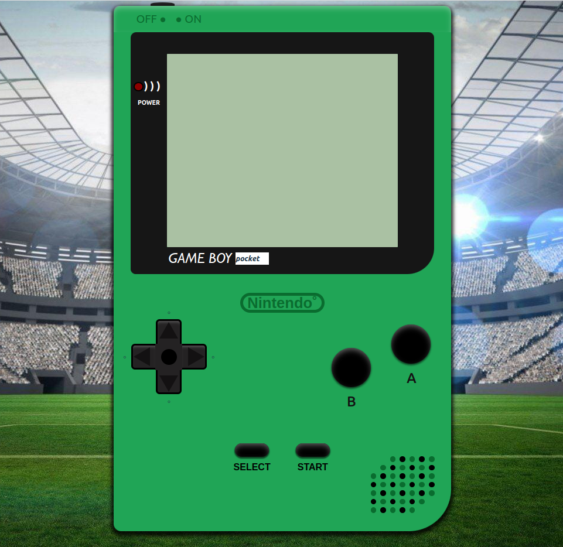

    

#  Contenido:
 

- ### [Descripción del proyecto 📋](#Descripción-del-proyecto)
- ### [Acerca de 🎮](#Acerca)
- ### [Desarrollo 🖥️](#Desarrollo)
- ### [Instalación 🔧](#Instalación)
- ### [Funcionamiento 📖](#Funcionamiento)
- ### [Responsive📱](#Responsive)
- ### [Repositorio GitHub 💾](#Repositorio)
- ### [Linkedin](#Linkedin)

    

### Descripción del proyecto 
 

##### Este proyecto se basa en una réplica de la GameBoy Pocket utilizando React y Css.

  

### Acerca de

#### La GameBoy Pocket fué fabricada por Nintendo y lanzada al mercado en 1996 en Japón y EEUU y en 1997 en Europa. Este modelo es una modificación de la Game Boy clásica. Comparada con el modelo clásico, la Pocket tenía un tamaño mucho más pequeño.

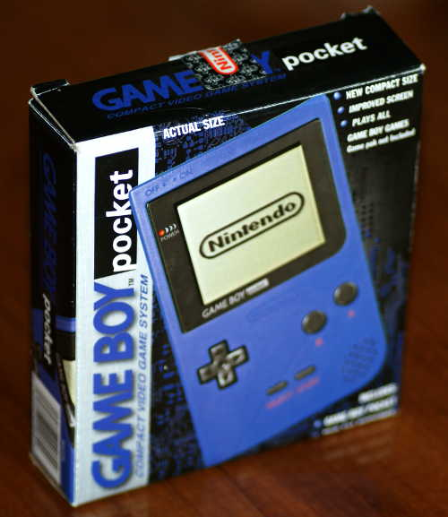

  

### Desarrollo

 

####    Para este proyecto se ha utilizado React con JavaScript y CSS, también contiene algunos gifs descargados de internet.

#### El cuerpo de la consola esta dividido en 3 secciones (arriba, centro y abajo) para así dividir los elementos principales entre la pantalla y las zonas de botones. Para el altavoz he usado una cuadricula de 7x7, a cada celda le he dado forma de círculo para imitar los agujeros del altavoz y he dividido los círculos segun se muestren, algunos no se muestran, algunos color negro y otros del color de la consola y así lograr imitar la forma de rombo que tiene el altavoz.

#### Absolutamente todo esta echo a mano por mi. Alguno botones son funcionales y estan preparados para interactuar con la consola.

 

### Instalación

##### Para instalar en local seguir los siguientes pasos: 

###### 1º- Clonar el repositorio.
###### 2º- $ npm install
###### 3º- $ npm run dev
###### Mostrará esto en la terminal :

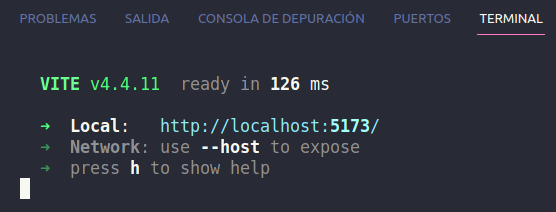

###### 4º- Ctrl + click en la dirección local que se muestra en azul.

###### Se abrirá el navegador con el contenido del proyecto.

 

### Funcionamiento

#### Para empezar a interactuar con la consola :

##### 1º- Pulsar el botón de encender (Parte superior izquierda), reproduce un gif con la presentación de GAMEBOY además de encenderse el led simulando que la consola esta ON.

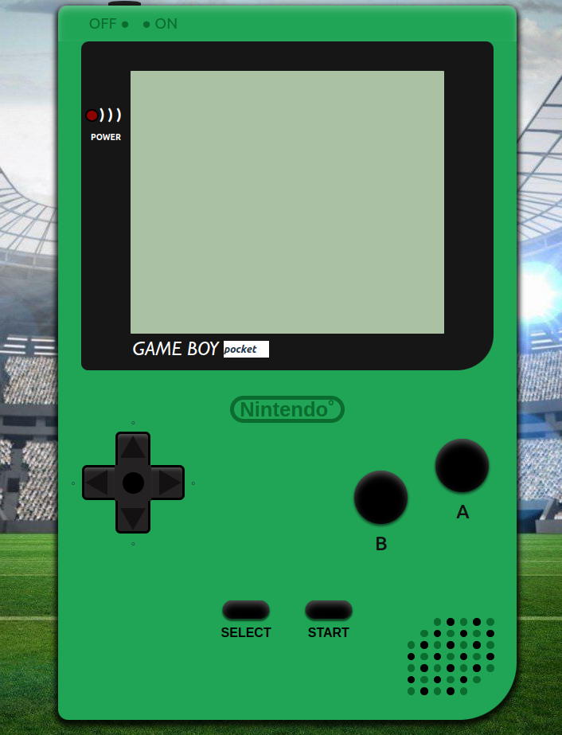{ width=290 } 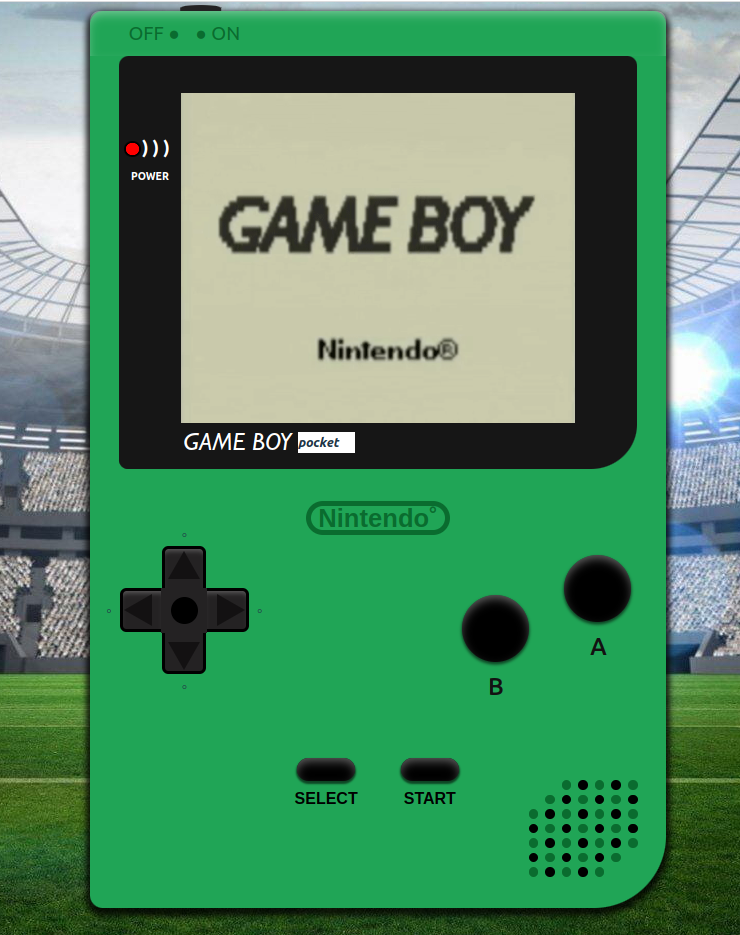{ width=300 }

<!--  
 -->

##### 2º- A continuación se mostrará una lista de juegos.

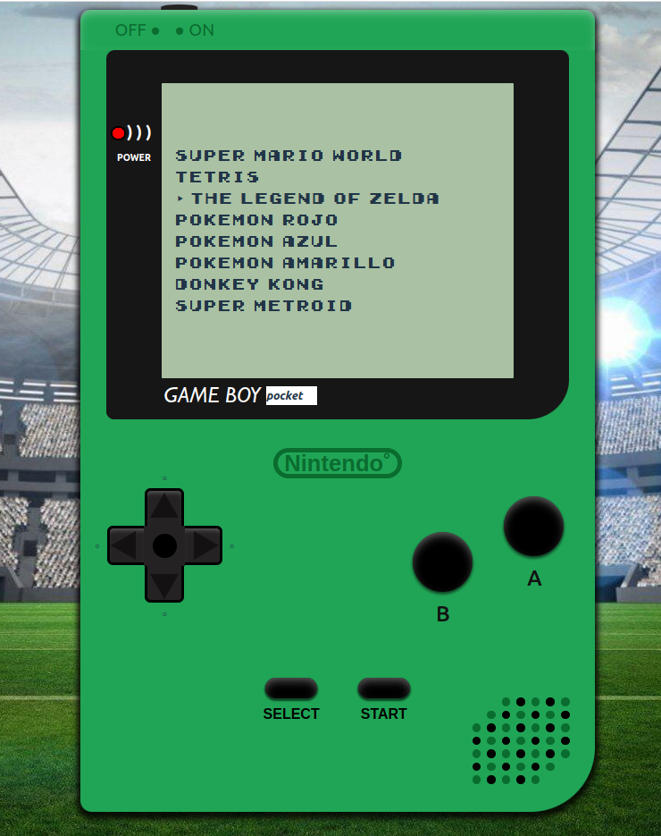

##### 3º- Selecciona el juego deseado y reproducirá un pequeño gif del juego en cuestión. Soy consciente de que la pantalla de la GameBoy Pocket no tiene color, aún así he añadido gifs a color.

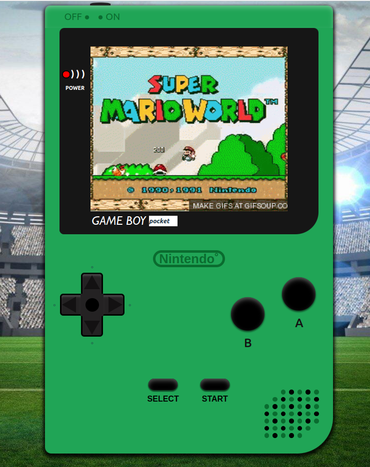{ width=200 } 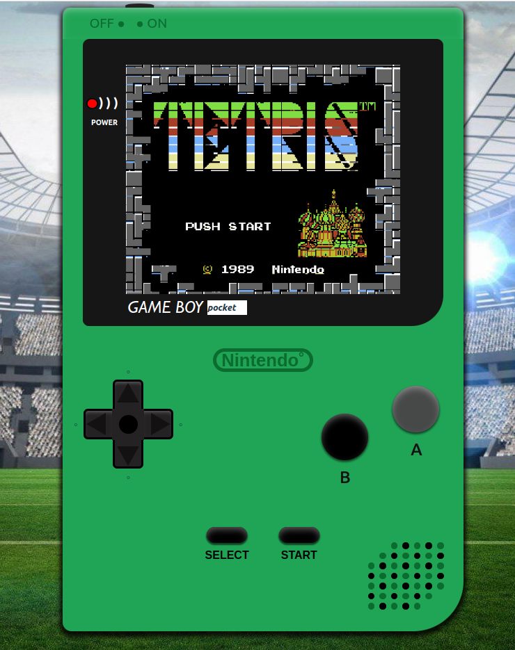{ width=200 } 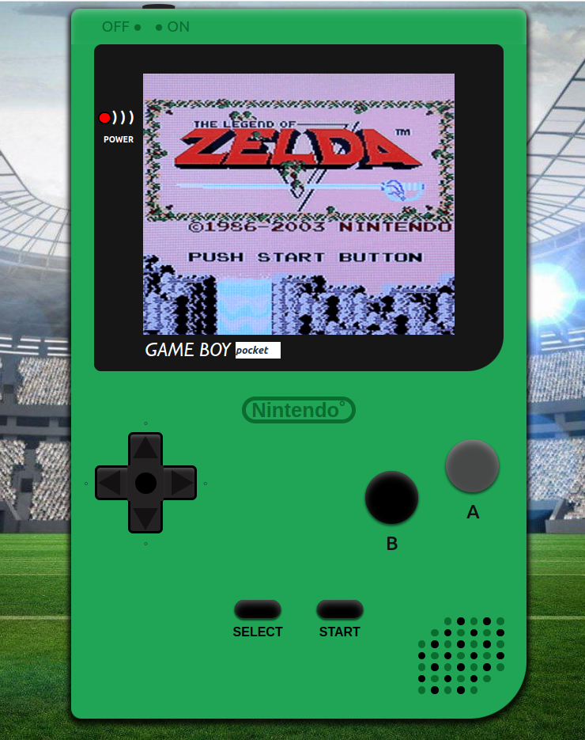{ width=200 }

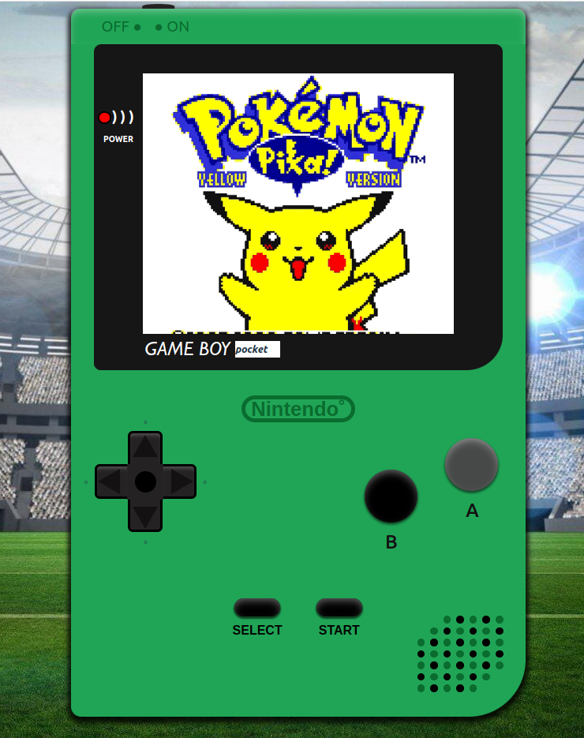{ width=200 } 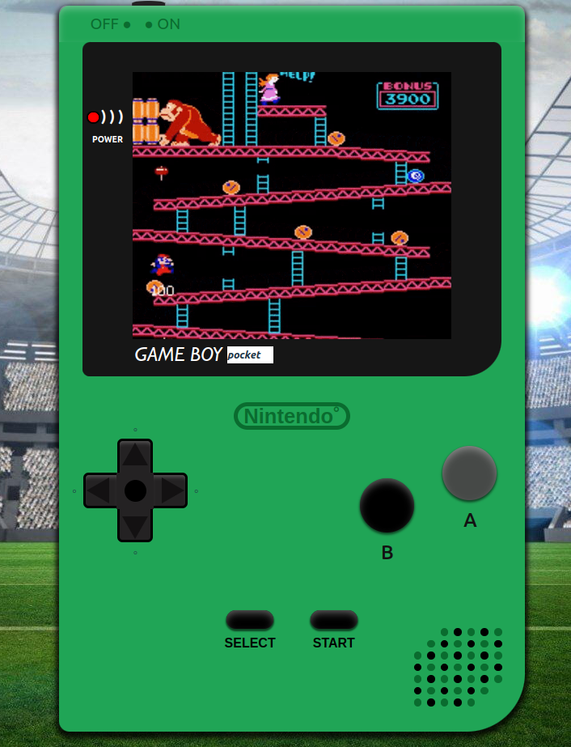{ width=200 } 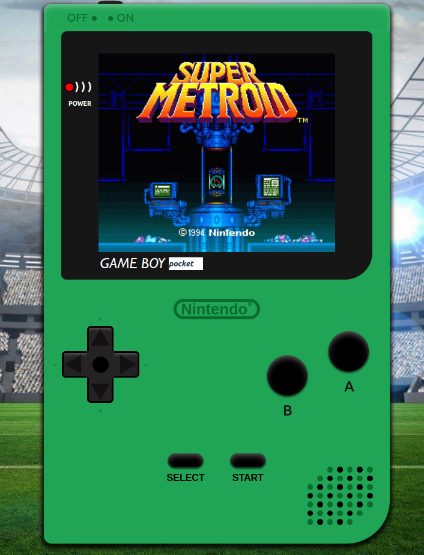{ width=200 }

<!-- 

 -->

##### 4º- Al volver a presionar en el boton de encendido, apagará la consola y el led volverá a apagarse junto con la pantalla y la consola retornará a su estado inicial.

 

### Responsive

 

#### Es absolutamente responsive. Todo con MediaQuerys, nada de Bootstrap.

 

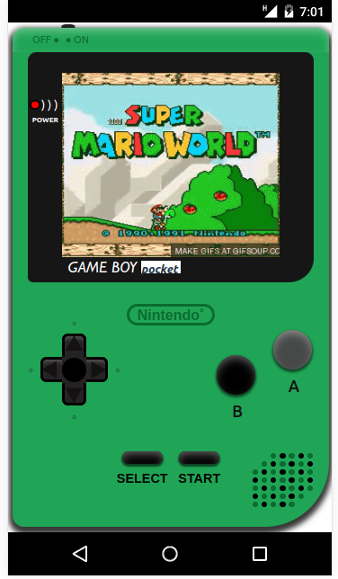

  

### Repositorio GitHub

#### https://github.com/xIMet3/gameBoyReact

### Linkedin

#### https://www.linkedin.com/in/joaquin-ruiz-padr%C3%B3s-81906b272/